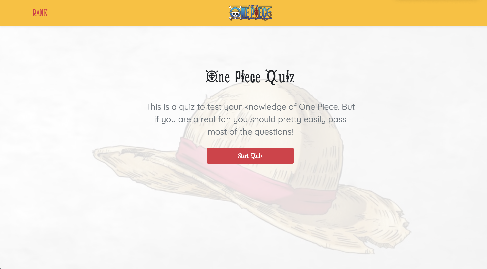

# Web APIs: Quiz Game

## Description

**User Story**

```
AS A One Piece fandom, I WANT to take a timed quiz on One Piece character fundamentals that stores high scores SO THAT to test if is a real fan or not.
```


**Acceptance Criteria**

```
GIVEN I am taking a One Piece quiz
WHEN I click the start button
THEN a timer starts and I am presented with a question
WHEN I answer a question
THEN I am presented with another question
WHEN I answer a question incorrectly
THEN time is subtracted from the clock
WHEN all questions are answered or the timer reaches 0
THEN the game is over
WHEN the game is over
THEN I can save my initials and score
```

**Techonologies Used**

```
 Javascript, HTML, and CSS on top of the Bootstrap framework
```


## Mock-Up




## Link to Deployed Application
[One Piece quiz](https://zhuxiaoyu1019.github.io/quiz-game/)
